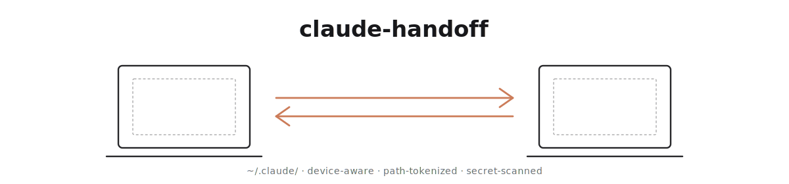

<div align="right">

**English** | [한국어](README.ko.md)

</div>

<picture>
  <source media="(prefers-color-scheme: dark)" srcset="docs/assets/hero-dark.svg">
  
</picture>

<p align="center">
  Hand off your Claude Code setup between devices — like Apple Handoff, but for <code>~/.claude/</code>.
</p>

---

## Why

Use Claude Code on multiple machines and you eventually copy `hooks.json` from your home Mac to your work Mac, only to watch every hook fail because `/Users/your-home-name/` doesn't exist under `/Users/your-work-name/`. `claude-handoff` tokenizes machine-specific paths so hooks Just Work, scans for secrets before anything leaves your machine, and supports N devices × M versions through a shared hub repository.

---

## Quick start

```bash
# 1. Plugin (inside Claude Code):
#    /plugin marketplace add im-ian/claude-handoff
#    /plugin install claude-handoff@claude-handoff

# 2. CLI (npm package pending):
git clone https://github.com/im-ian/claude-handoff.git && cd claude-handoff
npm install && npm run build && npm link

# 3. Init — creates a PRIVATE GitHub hub repo for you:
handoff init --create-hub my-claude-hub --device my-mac

# 4. Push:
handoff push

# 5. On another machine after init + plugin install:
handoff pull --from my-mac
```

Or use `/handoff-init`, `/handoff-push`, `/handoff-pull` inside Claude Code — the slash commands drive prompts via `AskUserQuestion` and never hang on the CLI's TTY interactions.

---

## Installation

**Plugin** (inside Claude Code):

```
/plugin marketplace add im-ian/claude-handoff
/plugin install claude-handoff@claude-handoff
```

Updates ride through `/plugin update`. For local-symlink installs (contributors), run `plugin/install.sh` from a clone — symlinks track the repo so `git pull` picks up new commands.

**CLI** (Node.js ≥ 20):

```bash
git clone https://github.com/im-ian/claude-handoff.git && cd claude-handoff
npm install && npm run build && npm link    # puts `handoff` on PATH
```

Verify: `handoff --version` (→ `0.0.1`); `handoff status` returns `Not initialized` until you run `init`.

**Uninstall:**

```bash
/plugin uninstall claude-handoff@claude-handoff   # plugin
npm unlink -g @im-ian/claude-handoff              # CLI
rm -rf ~/.claude-handoff                          # local config + hub clone (remote untouched)
```

---

## Commands

| Slash | CLI | Purpose |
|---|---|---|
| `/handoff-init` | `handoff init [--hub <url> \| --create-hub <name>] --device <name>` | Register device, link or create a hub |
| `/handoff-push` | `handoff push [--dry-run] [--skip-on-secrets \| --allow-secrets] [-m <msg>]` | Snapshot to hub (with secret scan) |
| `/handoff-pull` | `handoff pull --from <device> [--dry-run] [--confirm]` | Apply another device's snapshot |
| `/handoff-diff` | `handoff diff [--from <device>] [-p] [--files-only]` | Preview pull changes |
| `/handoff-status` | `handoff status` | Sync state + known devices |

`--help` on any subcommand for full flag listing.

---

## What gets synced

Conservative **allowlist** so unknown files never leak by accident.

- **Default include:** `agents/**`, `commands/**`, `hooks/**`, `skills/**`, `rules/**`, `scripts/**`, `mcp-configs/**`, `settings.json`, top-level `*.md`
- **Hard-deny (always excluded):** `projects/**`, `sessions/**`, `cache/**`, `telemetry/**`, `backups/**`, `*.log`, `*.jsonl`, `**/.credentials.json`, `**/.env*`, `**/*credentials*`, `**/*secret*`, `.DS_Store`
- **Custom:** edit `scope.include` / `scope.excludeExtra` in `~/.claude-handoff/config.json`. `excludeExtra` stacks on the hard-deny list.

---

## Tokenization

Hooks routinely embed absolute paths like `/Users/alice/.claude/hooks/format.sh`. Sync verbatim → username `bob` machine → every path breaks.

On push, two literals get rewritten to placeholders. On pull, they resolve back to the local machine's values:

| Token | Replaces |
|---|---|
| `${HANDOFF_CLAUDE}` | `$HOME/.claude` (absolute path) |
| `${HANDOFF_HOME}` | `$HOME` |

So `"command": "node \"/Users/alice/.claude/hooks/x.js\""` becomes `"node \"${HANDOFF_CLAUDE}/hooks/x.js\""` in the hub, then on bob's machine resolves to `"node \"/Users/bob/.claude/hooks/x.js\""` — automatically correct. Longest pattern wins so path nesting stays right.

`${HANDOFF_USER}` / `${HANDOFF_HOSTNAME}` exist but are **off by default** — bare usernames false-positive into prose (`alice` → `malice`/`palace`). Opt in via `substitutions: [{ "from": "alice", "to": "${HANDOFF_USER}" }]` in config when needed.

---

## Secret scanner

Every scoped text file (≤ 2 MB) is scanned for: Anthropic/OpenAI/GitHub/Google/AWS/Slack tokens, private key headers, JWTs, generic `password=` / `api_key=` literals.

- **Interactive (terminal, TTY).** Per-file: *skip* / *upload anyway* / *abort*. Public/unknown-visibility hubs additionally require a typed `yes` confirmation.
- **Non-interactive (CI, Bash tool, slash commands).** Pass `--skip-on-secrets` (auto-skip flagged files) or `--allow-secrets` (bypass entirely). The `/handoff-push` slash command drives this choice via `AskUserQuestion` after a `--dry-run` preflight surfaces findings.
- **False positives** (Django `SECRET_KEY` examples, test fixtures, password-pattern docs) → add file paths to `secretPolicy.allow` in config. Manual edits only — prevents click-fatigue from silently growing the list.

---

## Hub layout

```
<hub>/
├── devices/<name>/
│   ├── snapshot/         # tokenized scoped files
│   └── version.json      # timestamp, file count, byte count, host
└── manifest.json         # registry of all devices
```

One git commit on the hub = one push from one device. **N devices × M versions** emerges naturally from git history. No cross-device merging — `pull --from X` always applies X's complete snapshot atomically.

---

## Configuration

`~/.claude-handoff/config.json` — full schema in [`docs/DESIGN.md`](docs/DESIGN.md).

```json
{
  "device": "my-mac",
  "hubRemote": "https://github.com/<you>/<hub>.git",
  "claudeDir": "/Users/<you>/.claude",
  "scope": { "include": ["agents/**", "..."], "optIn": [], "excludeExtra": [] },
  "secretPolicy": { "allow": [] },
  "substitutions": []
}
```

`CLAUDE_HANDOFF_HOME` env var overrides the config/hub location (default `~/.claude-handoff/`) — useful for safe trial runs (`CLAUDE_HANDOFF_HOME=/tmp/trial handoff init …`) and per-user isolation in shared environments.

---

## Troubleshooting

- **`fatal: could not read Password for 'https://…@github.com'`** — set a local credential helper for the hub clone:
  ```bash
  git -C ~/.claude-handoff/hub config --local credential.helper '!gh auth git-credential'
  ```
  Multi-account: `gh auth switch --user <login>` first.

- **Hub visibility `UNKNOWN`** — non-GitHub host or `gh` missing/unauthenticated. Treated as potentially public; requires typed `yes` per file with findings.

- **Scope-change churn** — widening shows new files as `added`; narrowing leaves stale snapshot files (the hub doesn't auto-prune). Re-push from the owning device to rewrite its snapshot.

---

## Status

Working MVP, used in production. CLI source-only; npm publish pending.

**Roadmap:** `handoff log --device <name>`, `handoff pull --at <sha>`, auto credential-helper setup on `init`, npm release.

---

## Prior art

- [`claude-teleport`](https://github.com/anthropics/claude-code-plugins) — one-shot beam, no per-device awareness.
- Dotfile managers (`chezmoi`, `yadm`, `stow`) — general-purpose, require manual templating for path differences.

`claude-handoff` is purpose-built for Claude Code: knows which pieces are machine-specific vs. portable, with defaults that keep secrets out.

---

## License

MIT
